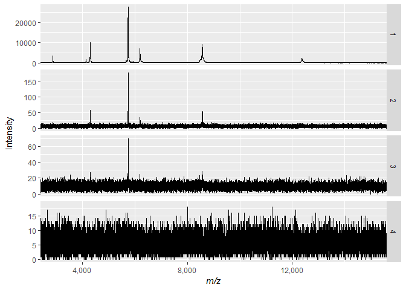
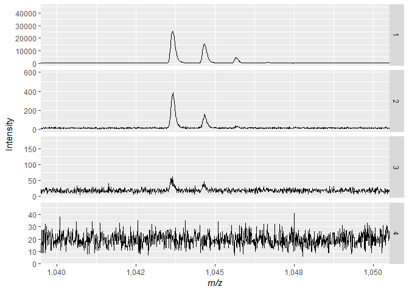

goodBad
================
Chase Clark
October 8, 2018

``` r
library(ggplot2)
```

    ## Warning: package 'ggplot2' was built under R version 3.5.1

``` r
library(MALDIquant)
```

    ## Warning: package 'MALDIquant' was built under R version 3.5.1

    ## 
    ## This is MALDIquant version 1.18
    ## Quantitative Analysis of Mass Spectrometry Data
    ##  See '?MALDIquant' for more information about this package.

``` r
library(MALDIquantForeign)
```

    ## Warning: package 'MALDIquantForeign' was built under R version 3.5.1

``` r
library(scales)
```

    ## Warning: package 'scales' was built under R version 3.5.1

``` r
counter <- 1
df <- NULL

for(i in seq_along(a)){

df <- rbind(df, cbind.data.frame(mass = a[[i]]@mass,
                  intensity = a[[i]]@intensity,
                  sample = rep(counter, length(a[[i]]@intensity))
           ))
       counter <-  counter + 1
  
}


ggplot(df, aes(x = mass, y =intensity)) +
  geom_line() +
  facet_grid(rows = vars(sample), scales = "free_y") +
  scale_x_continuous(labels = comma) +
  coord_cartesian(xlim = c(3000, 15000)) +
  xlab(expression(italic("m/z"))) +
  ylab("Intensity")
```



``` r
a <- MALDIquantForeign::importMzMl("data/smBad.mzML")
a <- a[c(2, 3, 4)]

b <- MALDIquantForeign::importMzMl("data/smGood.mzML")
b <- b[[6]]

a <- c(b, a)
```

``` r
counter <- 1
df <- NULL

for(i in seq_along(a)){

df <- rbind(df, cbind.data.frame(mass = a[[i]]@mass,
                  intensity = a[[i]]@intensity,
                  sample = rep(counter, length(a[[i]]@intensity))
           ))
counter <-  counter + 1
  
}


ggplot(df, aes(x = mass, y = intensity)) +
  geom_line() +
  facet_grid(rows = vars(sample), scales = "free_y") +
  scale_x_continuous(labels = comma) +
  coord_cartesian(xlim = c(1040, 1050)) +
  xlab(expression(italic("m/z"))) +
  ylab("Intensity")
```


